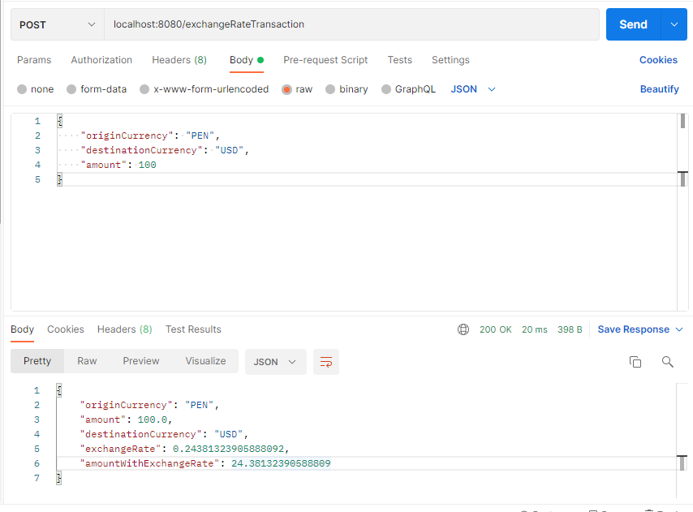
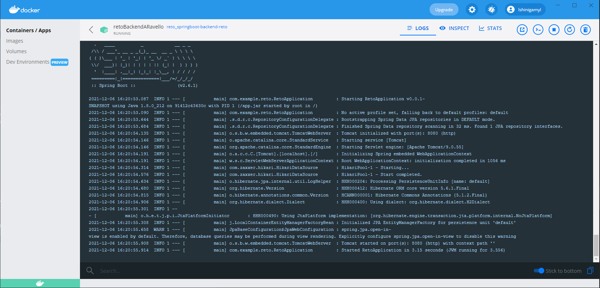
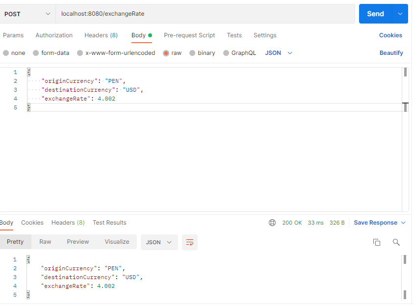
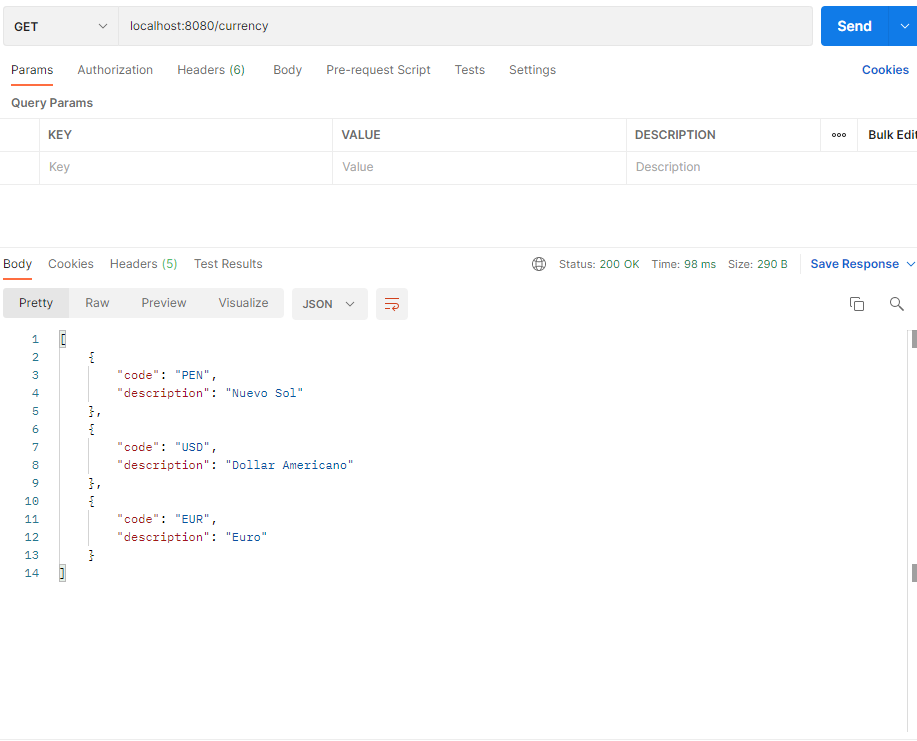
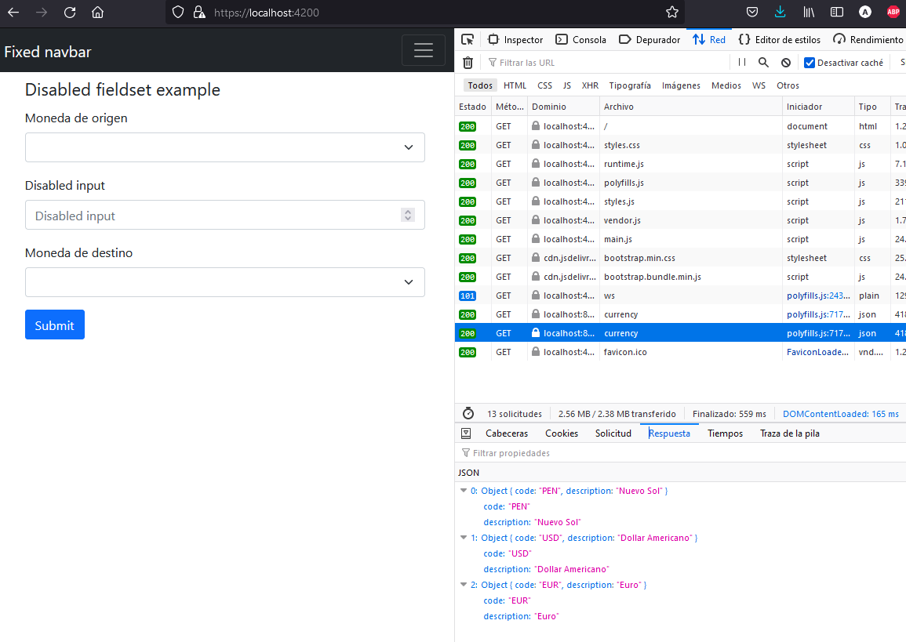

# Reto Backend

### Funcionalidades requeridas

* Se debe crear una API para aplicar un tipo de cambio a un monto.
* La API debe recibir el valor “monto“, “moneda origen”, “moneda destino“ y devolver el “monto”, “monto con tipo de cambio”, “moneda origen”, “moneda destino“  y “tipo de cambio”.
  *
* Se debe crear la información del tipo de cambio en una in memory database, por ejemplo H2.
* Dockerizar el JAR e invocar a la API desde el contenedor. (Windows o CentOS)
  *
* El uso de la API debe ser mostrada desde Postman.

### Funcionalidades Opcionales

* Crear un POST para actualizar el valor del tipo de cambio.
  *
* Implementar un front con angular que consuma la API.
  *
  *

